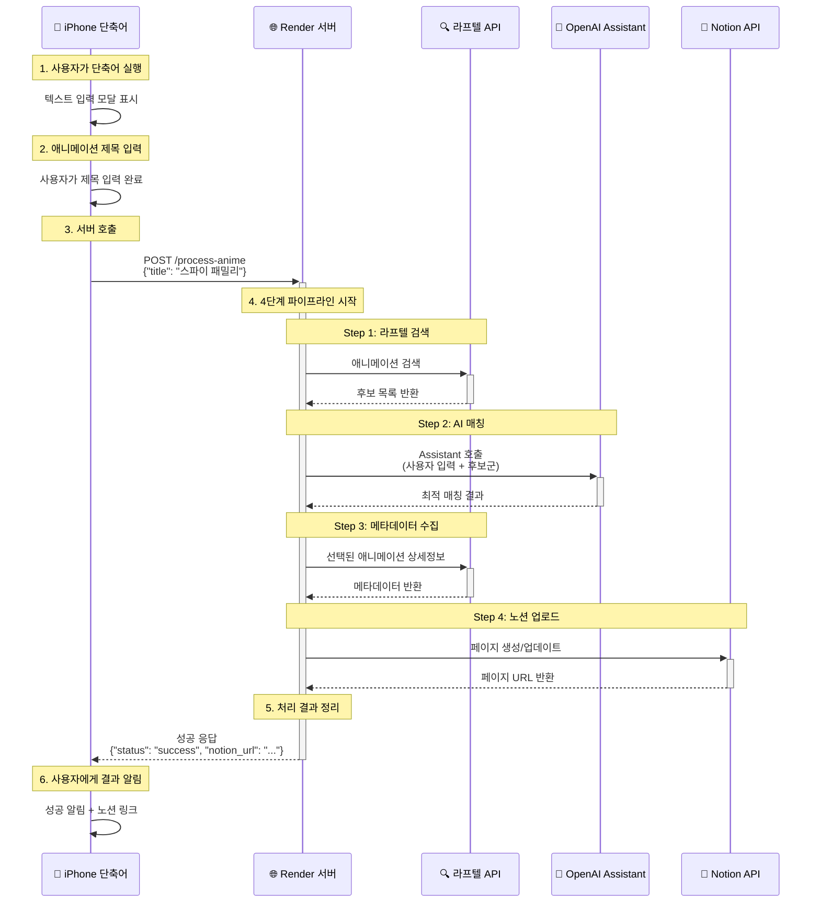
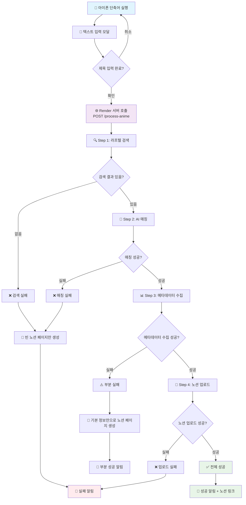

# 🎯 애니메이션 개별 처리 API 개발 계획

> **프로젝트명**: 애니메이션 메타데이터 개별 입력 시스템  
> **목표**: 아이폰 단축어를 통한 실시간 애니메이션 메타데이터 수집 및 노션 업로드  
> **배포**: Render 무료 호스팅 (월 750시간)  
> **사용량**: 개인용, 하루 5개 내외

## 📋 프로젝트 개요

### 🎯 목표
- **기존**: CSV 배치 처리 → **신규**: 개별 실시간 처리 추가
- 아이폰 단축어 → API 서버 → 노션 자동 업데이트 플로우 구축
- 기존 배치 처리 방식과 병행 운영 (코드 재사용 최대화)

### 🏆 완성 후 사용자 경험
1. 아이폰에서 단축어 실행
2. 애니메이션 제목 입력  
3. 30초 내 노션 페이지 자동 생성/업데이트
4. 완료 알림 + 노션 링크 제공

## 🔄 시스템 아키텍처

### 시퀀스 다이어그램


### 플로우 다이어그램


## 📁 최종 레포 구조

```
애니메이션 메타데이터 자동 입력/
├── 📄 README.md                    # 전체 프로젝트 설명
├── 📄 requirements.txt             # 공통 의존성
├── 📄 requirements-api.txt         # API 서버 전용 의존성 ✅ **생성완료**
├── 📄 env.example                  # 환경변수 템플릿 ✅ **업데이트완료** 
├── 📄 render.yaml                  # Render 배포 설정 ✅ **생성완료**
├── 📄 anime.csv                    # 배치용 CSV (기존)
├── 
├── 📁 src/
│   ├── 📄 __init__.py
│   │
│   ├── 📁 core/                    # 🔥 공통 코어 로직
│   │   ├── 📄 __init__.py
│   │   ├── 📄 config.py            # 통합 설정
│   │   ├── 📄 pipeline.py          # 4단계 파이프라인 통합
│   │   ├── 📄 laftel_client.py     # 라프텔 API 래퍼
│   │   ├── 📄 openai_client.py     # OpenAI Assistant 래퍼  
│   │   ├── 📄 notion_client.py     # 노션 API 래퍼
│   │   └── 📄 models.py            # 데이터 모델 정의
│   │
│   ├── 📁 batch/                   # 🔄 배치 처리 (기존 방식)
│   │   ├── 📄 __init__.py
│   │   ├── 📄 processor.py         # BatchProcessor 리팩토링
│   │   ├── 📄 monitor.py           # 배치 상태 확인
│   │   ├── 📄 resumer.py           # 실패 항목 재시작
│   │   └── 📁 cli/                 # CLI 도구들
│   │       ├── 📄 run_batch.py     # 배치 실행
│   │       ├── 📄 check_status.py  # 상태 확인
│   │       └── 📄 resume_failed.py # 재시작
│   │
│   ├── 📁 api/                     # 🌐 API 서버 (신규)
│   │   ├── 📄 __init__.py
│   │   ├── 📄 main.py              # FastAPI 메인 서버
│   │   ├── 📄 routers/             
│   │   │   ├── 📄 __init__.py
│   │   │   ├── 📄 anime.py         # 애니메이션 처리 API
│   │   │   └── 📄 health.py        # 헬스체크 API
│   │   ├── 📄 processor.py         # 개별 애니메이션 처리기
│   │   ├── 📄 schemas.py           # API 스키마 정의
│   │   └── 📄 middleware.py        # API 미들웨어
│   │
│   └── 📁 anime_metadata/          # 📦 레거시 (하위호환)  
│       ├── 📄 __init__.py
│       └── 📄 legacy_compat.py     # 기존 코드 호환성
│
├── 📁 docs/                        # 📚 문서화
│   ├── 📄 README.md                # 전체 가이드
│   ├── 📄 개별-처리-API-개발계획.md    # 이 문서
│   ├── 📄 render-deployment-guide.md # Render 배포 상세 가이드 ✅ **생성완료**
│   ├── 📄 batch-guide.md           # 배치 처리 가이드
│   ├── 📄 api-guide.md             # API 서버 가이드  
│   ├── 📄 iphone-shortcut.md       # 아이폰 단축어 설정
│   └── 📄 system_prompt.md         # OpenAI Assistant 프롬프트
│
├── 📁 examples/                    # 💡 예제들
│   ├── 📄 README.md
│   ├── 📄 sample_anime.csv         # 배치용 샘플
│   ├── 📄 api_test.py              # API 테스트 스크립트
│   └── 📄 shortcuts/               # 아이폰 단축어 파일들
│       └── 📄 anime-processor.shortcut
│
├── 📁 scripts/                     # 🔧 유틸리티 스크립트
│   ├── 📄 setup_env.py             # 환경 설정 도움
│   ├── 📄 test_pipeline.py         # 파이프라인 테스트
│   └── 📄 deploy_render.sh         # Render 배포 스크립트
│
└── 📁 playground/                  # 🧪 개발/테스트용 (gitignore)
```

## 🚀 단계별 개발 계획

> **⚠️ 중요**: 각 Phase별로 **사용자 개입 필요 지점**이 있습니다. 해당 지점에서는 개발을 일시정지하고 사용자 작업 완료를 기다립니다.

### **Phase 0: 기존 시스템 베이스라인 검증** ⭐ **신규 추가** (예상 소요: 0.3일)

#### 📋 TODO - Phase 0  
- [ ] **P0-1**: 기존 배치 처리 시스템 현재 상태 확인
- [ ] **P0-2**: 작은 테스트 CSV로 기존 시스템 동작 검증 (3개 애니메이션)
- [ ] **P0-3**: 베이스라인 결과 저장 (리팩토링 후 비교 기준점)
- [ ] **P0-4**: 현재 dependency 및 import 경로 문서화
- [ ] **P0-5**: **🧪 Phase 0 검증**: 기존 시스템 완전 동작 확인

#### 🧪 **Phase 0 검증 체크리스트**
```bash
# 기존 배치 처리 시스템 동작 확인
cd src/anime_metadata/tools
python batch_processor.py --csv ../../../examples/sample_anime.csv --description "베이스라인 테스트"

# 결과 확인
python check_status.py --brief

# 베이스라인 결과 문서화 
echo "✅ 기존 시스템 동작 확인 - [날짜] 베이스라인 설정 완료"
```

#### 📊 **Git 워크플로우**
```bash
# Phase 0 시작 전
git switch -c backup/phase-0-$(date +%Y%m%d)

# Phase 0 완료 후 자동 커밋
git add .
git commit -m "✅ step: Phase 0 기존 시스템 베이스라인 검증 완료

- 기존 배치 처리 시스템 동작 확인
- 베이스라인 결과 저장 (리팩토링 비교 기준점)
- dependency 및 import 경로 문서화"
```

### **Phase 1: 기반 준비** (예상 소요: 0.5일)

#### 📋 TODO - Phase 1
- [x] **P1-1**: `requirements-api.txt` 생성 (FastAPI, uvicorn 추가) ✅ **완료**
- [x] **P1-2**: `render.yaml` 배포 설정 파일 생성 ✅ **완료**
- [ ] **P1-3**: 디렉토리 구조 생성 (`src/core/`, `src/api/`, `src/batch/`)
- [x] **P1-4**: `env.example` API 서버용 환경변수 추가 ✅ **완료**
- [ ] **P1-5**: **🧪 Phase 1 검증**: 설정 파일 문법 및 의존성 확인

#### 📝 상세 작업
```bash
# P1-1: requirements-api.txt (완료됨)
# 기존 requirements.txt 포함 + FastAPI 관련 의존성
-r requirements.txt
fastapi>=0.104.0
uvicorn[standard]>=0.24.0
pydantic>=2.0.0
httpx>=0.25.0  # 비동기 HTTP 클라이언트

# P1-2: render.yaml (완료됨)
services:
  - type: web
    name: anime-metadata-api
    env: python
    region: singapore
    buildCommand: pip install -r requirements-api.txt
    startCommand: python -m uvicorn src.api.main:app --host 0.0.0.0 --port $PORT
```

#### 🧪 **Phase 1 검증 체크리스트**
```bash
# 설정 파일 문법 확인
python -c "import yaml; yaml.safe_load(open('render.yaml'))" 
# 의존성 파일 확인  
pip install --dry-run -r requirements-api.txt
# 환경변수 템플릿 확인
cat env.example  # 필요한 변수들이 모두 있는지 확인
```

#### 📊 **Git 워크플로우 - Phase 1**
```bash
# Phase 1 시작 전
git switch -c backup/phase-1-$(date +%Y%m%d)

# Phase 1 완료 후 자동 커밋 (변경 파일 ~10개 예상)
git add .
git commit -m "✨ feat: Phase 1 기반 준비 완료

- 디렉토리 구조 생성 (src/core/, src/api/, src/batch/)
- requirements-api.txt, render.yaml, env.example 준비 완료
- 개발 환경 기본 설정 완료"
```

### **Phase 2: 코어 모듈 리팩토링** (예상 소요: 1일)

#### 📋 TODO - Phase 2
- [ ] **P2-1**: `src/core/config.py` - 기존 config 통합 및 API 설정 추가
- [ ] **P2-2**: `src/core/models.py` - 데이터 모델 정의
- [ ] **P2-3**: `src/core/laftel_client.py` - 라프텔 API 래퍼 클래스
- [ ] **P2-4**: `src/core/openai_client.py` - OpenAI Assistant 래퍼 클래스
- [ ] **P2-5**: `src/core/notion_client.py` - 노션 API 래퍼 클래스
- [ ] **P2-6**: `src/core/pipeline.py` - 통합 파이프라인 클래스
- [ ] **P2-7**: **🧪 Phase 2 검증**: 모든 코어 모듈 기본 임포트 및 초기화 테스트

#### 📝 상세 작업 - 핵심 클래스 설계

**`src/core/pipeline.py`** - 가장 중요한 파일
```python
from typing import Dict, Any, Optional
from .models import AnimeRequest, ProcessResult
from .laftel_client import LaftelClient
from .openai_client import OpenAIClient  
from .notion_client import NotionClient

class AnimePipeline:
    """통합 애니메이션 처리 파이프라인"""
    
    def __init__(self, config):
        self.laftel = LaftelClient()
        self.openai = OpenAIClient()
        self.notion = NotionClient()
    
    async def process_single(self, title: str) -> ProcessResult:
        """단일 애니메이션 처리 (배치/API 공통 로직)"""
        # Step 1: 라프텔 검색
        search_result = await self.laftel.search_anime(title)
        
        # Step 2: AI 매칭  
        if search_result.candidates:
            match_result = await self.openai.find_best_match(title, search_result.candidates)
        else:
            match_result = None
            
        # Step 3: 메타데이터 수집
        metadata = None
        if match_result and match_result.success:
            metadata = await self.laftel.get_metadata(match_result.selected_title)
            
        # Step 4: 노션 업로드
        notion_result = await self.notion.create_or_update_page(title, metadata)
        
        return ProcessResult(
            title=title,
            success=notion_result.success,
            notion_url=notion_result.page_url,
            metadata=metadata,
            steps_completed=4 if notion_result.success else 3
        )
```

**`src/core/models.py`** - 데이터 모델
```python
from pydantic import BaseModel
from typing import Optional, Dict, Any, List
from datetime import datetime

class AnimeRequest(BaseModel):
    title: str
    user_id: Optional[str] = None
    
class ProcessResult(BaseModel):
    title: str
    success: bool
    notion_url: Optional[str] = None
    error: Optional[str] = None
    metadata: Optional[Dict[str, Any]] = None
    processing_time: Optional[float] = None
    steps_completed: int = 0
    timestamp: datetime
```

#### 🧪 **Phase 2 검증 체크리스트**
```python
# 각 모듈 기본 임포트 테스트
python -c "from src.core.config import *; print('✅ config 모듈 정상')"
python -c "from src.core.models import *; print('✅ models 모듈 정상')"
python -c "from src.core.laftel_client import LaftelClient; print('✅ laftel_client 모듈 정상')"
python -c "from src.core.openai_client import OpenAIClient; print('✅ openai_client 모듈 정상')"
python -c "from src.core.notion_client import NotionClient; print('✅ notion_client 모듈 정상')"
python -c "from src.core.pipeline import AnimePipeline; print('✅ pipeline 모듈 정상')"

# 기본 초기화 테스트 (API 호출 없이 객체 생성만)
python -c "
from src.core.pipeline import AnimePipeline
pipeline = AnimePipeline(None)  # 설정 없이 기본 초기화만 테스트
print('✅ AnimePipeline 기본 초기화 성공')
"
```

#### 📊 **Git 워크플로우 - Phase 2**
```bash
# Phase 2 시작 전  
git switch -c backup/phase-2-$(date +%Y%m%d)

# Phase 2 완료 후 자동 커밋 (변경 파일 ~15개 예상)
git add .
git commit -m "✨ feat: Phase 2 코어 모듈 리팩토링 완료

- 통합 AnimePipeline 클래스 구현
- 라프텔, OpenAI, 노션 클라이언트 래퍼 완성  
- 공통 데이터 모델 및 설정 통합
- 배치/API 공통 로직 분리 완료"
```

### **Phase 3: API 서버 구축** 🛑 **사용자 개입 필요** (예상 소요: 1일)

#### 📋 TODO - Phase 3  
- [ ] **P3-1**: `src/api/main.py` - FastAPI 앱 기본 구조
- [ ] **P3-2**: `src/api/schemas.py` - API 요청/응답 스키마
- [ ] **P3-3**: `src/api/routers/health.py` - 헬스체크 엔드포인트
- [ ] **P3-4**: `src/api/routers/anime.py` - 메인 애니메이션 처리 API
- [ ] **P3-5**: `src/api/processor.py` - API용 애니메이션 처리기
- [ ] **P3-6**: `src/api/middleware.py` - CORS, 로깅 등 미들웨어
- [ ] **P3-7**: **🧪 Phase 3 검증**: 로컬 API 서버 시작 및 기본 엔드포인트 테스트

#### 📝 상세 작업 - API 엔드포인트

**`src/api/routers/anime.py`** - 핵심 API
```python
from fastapi import APIRouter, HTTPException
from ..schemas import AnimeRequest, AnimeResponse
from ..processor import ApiAnimeProcessor

router = APIRouter(prefix="/api/v1", tags=["anime"])

@router.post("/process-anime", response_model=AnimeResponse)
async def process_anime(request: AnimeRequest):
    """개별 애니메이션 즉시 처리"""
    processor = ApiAnimeProcessor()
    
    try:
        result = await processor.process(request.title)
        
        if result.success:
            return AnimeResponse(
                status="success",
                anime_title=request.title,
                matched_title=result.metadata.get("name") if result.metadata else None,
                notion_page_url=result.notion_url,
                processing_time=result.processing_time,
                steps_completed=result.steps_completed,
                metadata=result.metadata
            )
        else:
            return AnimeResponse(
                status="error", 
                anime_title=request.title,
                error_message=result.error,
                steps_completed=result.steps_completed
            )
            
    except Exception as e:
        raise HTTPException(status_code=500, detail=str(e))

@router.get("/health")
async def health_check():
    """서버 상태 확인"""
    return {"status": "healthy", "timestamp": datetime.now().isoformat()}
```

#### 🧪 **Phase 3 검증 체크리스트**
```bash
# 1. FastAPI 앱 임포트 테스트
python -c "from src.api.main import app; print('✅ FastAPI 앱 임포트 성공')"

# 2. 로컬 서버 시작 테스트
python -m uvicorn src.api.main:app --reload --host 127.0.0.1 --port 8000 &
SERVER_PID=$!
sleep 3  # 서버 시작 대기

# 3. 헬스체크 엔드포인트 테스트
curl -f http://localhost:8000/health || echo "❌ 헬스체크 실패"
echo "✅ 헬스체크 성공"

# 4. 기본 API 엔드포인트 구조 테스트 (실제 처리는 하지 않고 응답만 확인)
curl -X POST http://localhost:8000/api/v1/process-anime \
  -H "Content-Type: application/json" \
  -d '{"title":"테스트"}' || echo "❌ API 엔드포인트 접근 실패"

# 5. 서버 종료
kill $SERVER_PID
echo "✅ 로컬 API 서버 기본 동작 확인 완료"
```

#### 🛑 **사용자 개입 지점 - Phase 3**
```bash
# 로컬 API 서버 테스트 전 환경변수 설정 필요
🛑 개발 일시정지 - 사용자 작업 필요:

1. .env 파일 생성:
   cp env.example .env
   
2. 실제 API 키들로 .env 파일 수정:
   - OPENAI_API_KEY=sk-proj-... (실제 키)
   - OPENAI_ASSISTANT_ID=asst_... (실제 Assistant ID)  
   - NOTION_TOKEN=secret_... (실제 노션 토큰)
   - NOTION_DATABASE_ID=... (실제 DB ID)

3. API 키 유효성 간단 확인:
   python -c "import openai; print('OpenAI 키 정상')"
   
✅ 완료 후 "환경변수 설정 완료" 라고 알려주세요
```

#### 📊 **Git 워크플로우 - Phase 3**
```bash
# Phase 3 시작 전
git switch -c backup/phase-3-$(date +%Y%m%d)

# Phase 3 완료 후 자동 커밋 (변경 파일 ~12개 예상)
# 주의: .env 파일은 .gitignore로 제외됨
git add .
git commit -m "✨ feat: Phase 3 API 서버 구축 완료

- FastAPI 앱 및 라우터 구현
- 헬스체크 및 애니메이션 처리 API 완성
- CORS 및 미들웨어 설정
- 로컬 서버 동작 확인 완료"
```

### **Phase 4: 배치 모듈 리팩토링 + 통합 테스트** ⭐ **강화됨** (예상 소요: 0.8일)

#### 📋 TODO - Phase 4
- [ ] **P4-1**: `src/batch/processor.py` - BatchProcessor 코어 분리
- [ ] **P4-2**: `src/batch/cli/run_batch.py` - CLI 실행기 리팩토링  
- [ ] **P4-3**: 기존 `src/anime_metadata/tools/` → `src/batch/cli/` 이동
- [ ] **P4-4**: 하위 호환성 확인 및 `legacy_compat.py` 작성
- [ ] **P4-5**: **🧪 Phase 4 검증**: 기존 배치 기능 회귀 테스트 및 새 구조 동작 확인
- [ ] **P4-6**: **🧪 실제 CSV 파일로 새 배치 시스템 통합 테스트** ⭐ **신규 추가**
- [ ] **P4-7**: **🧪 베이스라인 vs 리팩토링 결과 비교 검증** ⭐ **신규 추가**  
- [ ] **P4-8**: **🧪 기존 프로덕션 결과와 호환성 확인** ⭐ **신규 추가**

#### 🧪 **Phase 4 검증 체크리스트**
```python
# 1. 기존 배치 모듈 접근성 확인 (하위 호환성)
python -c "
try:
    from src.anime_metadata.config import *
    print('✅ 기존 config 접근 가능')
except Exception as e:
    print(f'⚠️ 기존 config 접근 문제: {e}')
"

# 2. 새로운 배치 모듈 동작 확인
python -c "
from src.batch.processor import BatchProcessor
processor = BatchProcessor()
print('✅ 새 BatchProcessor 초기화 성공')
"

# 3. 기존 배치 처리 방식이 여전히 동작하는지 확인 (실제 배치는 실행하지 않고 구조만)
python -c "
from src.batch.cli.run_batch import main
print('✅ 배치 실행기 임포트 성공 - 기존 방식 유지됨')
"

# 4. 🔥 실제 CSV 파일로 새 배치 시스템 통합 테스트 (⭐ 신규 추가)
echo "🧪 실제 배치 처리 테스트 시작..."
python src/batch/cli/run_batch.py --csv examples/sample_anime.csv --description "리팩토링 후 통합 테스트"

# 5. 🔥 베이스라인 vs 리팩토링 결과 비교 (⭐ 신규 추가)  
echo "🧪 베이스라인과 리팩토링 결과 비교 중..."
# Phase 0에서 저장한 베이스라인과 현재 결과 비교
python scripts/compare_batch_results.py --baseline phase0_results --current latest_results

# 6. 🔥 기존 프로덕션 데이터 호환성 확인 (⭐ 신규 추가)
echo "🧪 기존 프로덕션 데이터 호환성 확인 중..."  
python scripts/check_production_compatibility.py --check-latest
```

#### 📊 **Git 워크플로우 - Phase 4**
```bash
# Phase 4 시작 전
git switch -c backup/phase-4-$(date +%Y%m%d)

# Phase 4 완료 후 자동 커밋 (변경 파일 ~20개 예상)
git add .
git commit -m "♻️ refactor: Phase 4 배치 모듈 리팩토링 + 통합 테스트 완료

- BatchProcessor 코어 분리 및 새 구조 적용
- 기존 tools/ → src/batch/cli/ 이동 완료
- 하위 호환성 유지 (legacy_compat.py)
- 실제 CSV 파일 통합 테스트 통과
- 베이스라인 대비 결과 일치 확인
- 기존 프로덕션 데이터 호환성 검증 완료"
```

### **Phase 5: Render 배포 및 테스트** 🛑 **사용자 개입 필요** (예상 소요: 0.5일)

#### 📋 TODO - Phase 5
- [ ] **P5-1**: **📚 `docs/render-deployment-guide.md` 참고하여 Render 배포 진행**
- [ ] **P5-2**: Render 서비스 생성 및 GitHub 연동  
- [ ] **P5-3**: 환경변수 설정 (OPENAI_API_KEY, NOTION_TOKEN 등)
- [ ] **P5-4**: API 서버 배포 테스트
- [ ] **P5-5**: `examples/api_test.py` 로 엔드포인트 테스트
- [ ] **P5-6**: 실제 애니메이션 제목으로 전체 플로우 테스트

#### 📝 테스트 시나리오
```python
# examples/api_test.py
import requests
import json

API_BASE = "https://your-app.onrender.com/api/v1"

def test_process_anime():
    response = requests.post(f"{API_BASE}/process-anime", json={
        "title": "스파이 패밀리"  
    })
    
    print(f"Status: {response.status_code}")
    print(f"Response: {json.dumps(response.json(), indent=2, ensure_ascii=False)}")

if __name__ == "__main__":
    test_process_anime()
```

#### 🛑 **사용자 개입 지점 - Phase 5**
```bash  
# Render 배포를 위한 사용자 작업 필요
🛑 개발 일시정지 - 사용자 작업 필요:

📚 상세 가이드: docs/render-deployment-guide.md 참고

1. Render 계정 생성 (https://render.com)
2. GitHub 저장소 연동 권한 부여
3. 웹 서비스 생성:
   - 서비스명: anime-metadata-api
   - 리전: Singapore
   - 빌드 명령어: pip install -r requirements-api.txt
   - 시작 명령어: python -m uvicorn src.api.main:app --host 0.0.0.0 --port $PORT
4. 환경변수 설정 (Render 대시보드):
   - OPENAI_API_KEY=sk-proj-...
   - OPENAI_ASSISTANT_ID=asst_...
   - NOTION_TOKEN=secret_...
   - NOTION_DATABASE_ID=...
5. 배포 대기 (5-10분 소요)

✅ 완료 후 "배포 완료, URL: https://xxx.onrender.com" 형식으로 알려주세요
```

#### 📊 **Git 워크플로우 - Phase 5**
```bash
# Phase 5 시작 전
git switch -c backup/phase-5-$(date +%Y%m%d)

# Phase 5 완료 후 자동 커밋 (변경 파일 ~5개 예상)
git add .
git commit -m "🚀 deploy: Phase 5 Render 배포 완료

- Render 서비스 설정 및 배포 성공
- 환경변수 설정 완료
- 프로덕션 환경에서 API 서버 정상 동작 확인
- 외부 접근 가능한 URL 확보"
```

### **Phase 6: 아이폰 단축어 제작** 🛑 **사용자 개입 필요** (예상 소요: 0.5일)

#### 📋 TODO - Phase 6
- [ ] **P6-1**: 기본 단축어 제작 (텍스트 입력 → HTTP 요청)
- [ ] **P6-2**: 응답 처리 로직 (성공/실패 알림)
- [ ] **P6-3**: 노션 링크 자동 열기 기능
- [ ] **P6-4**: `docs/iphone-shortcut.md` 설정 가이드 작성
- [ ] **P6-5**: `.shortcut` 파일 생성 및 `examples/shortcuts/`에 저장

#### 📝 단축어 구성 요소
1. **텍스트 입력** - "애니메이션 제목을 입력하세요"
2. **웹 요청** - POST 요청을 Render URL로 전송  
3. **JSON 파싱** - 응답에서 status, notion_url 추출
4. **조건부 액션** - 성공 시 노션 링크 열기, 실패 시 에러 알림
5. **알림 표시** - 처리 결과 사용자에게 알림

#### 🛑 **사용자 개입 지점 - Phase 6**
```bash
# 아이폰 단축어 설정 및 테스트 필요
🛑 개발 일시정지 - 사용자 작업 필요:

1. 단축어 파일 받기:
   examples/shortcuts/anime-processor.shortcut 다운로드
   
2. 아이폰에서 단축어 설치:
   - 파일 열기 → "단축어 추가"
   - 신뢰할 수 없는 단축어 허용 필요시 설정
   
3. 단축어에서 서버 URL 수정:
   - 단축어 편집 모드
   - "URL" 부분을 실제 Render URL로 변경
   - 예: https://anime-metadata-api.onrender.com
   
4. 실제 테스트:
   - 단축어 실행
   - "스파이 패밀리" 입력
   - 노션 페이지 생성 확인
   - 처리 시간 및 응답 확인

✅ 완료 후 "단축어 테스트 성공, 노션 페이지 생성됨" 형식으로 알려주세요
```

#### 📊 **Git 워크플로우 - Phase 6**
```bash
# Phase 6 시작 전
git switch -c backup/phase-6-$(date +%Y%m%d)

# Phase 6 완료 후 자동 커밋 (변경 파일 ~8개 예상)
git add .
git commit -m "📱 feat: Phase 6 아이폰 단축어 제작 완료

- 아이폰 단축어 파일 생성 및 테스트 완료
- 전체 플로우 (아이폰 → Render → 노션) 동작 확인
- 사용자 가이드 문서 작성
- 프로젝트 최종 완성"

# 🎉 전체 개발 완료 후 선택적 푸시 (사용자 요청시만)
# git push origin main  # 사용자가 "푸시해줘" 라고 요청할 때만
```

## 🔧 기술 스택 및 도구

### **Backend**
- **FastAPI** - 현대적이고 빠른 Python API 프레임워크
- **Pydantic** - 데이터 검증 및 설정 관리
- **Uvicorn** - ASGI 서버

### **호스팅**
- **Render** - 무료 호스팅 (월 750시간)
- **GitHub** - 코드 저장소 및 자동 배포

### **클라이언트**  
- **아이폰 단축어** - 네이티브 HTTP 클라이언트
- **Web UI** (선택적) - 간단한 HTML 인터페이스

### **외부 API**
- **라프텔** - 애니메이션 검색 및 메타데이터
- **OpenAI Assistant** - 스마트 매칭
- **Notion API** - 페이지 생성/업데이트

## 📊 예상 성능 및 제약사항

### **응답 시간**
- 성공 케이스: 15-30초 (AI 처리 시간 포함)
- 검색 실패: 5-10초
- 콜드 스타트: +10-15초 (Render 무료 계층)

### **제약사항**
- Render 무료: 15분 비활성화 후 sleep
- OpenAI API: 분당 요청 제한
- 하루 5개 사용량이므로 충분히 실용적

### **에러 처리**
- 라프텔 검색 실패 → 빈 노션 페이지 생성
- AI 매칭 실패 → 첫 번째 후보 선택
- 노션 업로드 실패 → 재시도 로직

## 🎯 완료 조건 및 검증

### **Phase별 완료 조건**
- **Phase 1**: 디렉토리 구조와 설정 파일들이 올바르게 생성됨
- **Phase 2**: 코어 모듈들이 독립적으로 동작하고 테스트 통과
- **Phase 3**: API 서버가 로컬에서 정상 동작
- **Phase 4**: 기존 배치 처리가 새 구조에서 정상 동작
- **Phase 5**: Render 배포 후 외부에서 API 접근 가능
- **Phase 6**: 아이폰 단축어로 전체 플로우 테스트 성공

### **최종 검증 시나리오**
1. 아이폰 단축어로 "스파이 패밀리" 입력
2. 30초 내 노션 페이지 생성 확인
3. 메타데이터가 올바르게 채워져 있는지 확인
4. 실패 케이스 테스트 ("존재하지않는애니메이션")
5. 기존 배치 처리도 여전히 동작하는지 확인

## 🚨 주의사항 및 트러블슈팅

### **개발 중 주의사항**
- 기존 배치 처리 기능을 망가뜨리지 말 것
- API 키들이 하드코딩되지 않도록 주의
- Render 환경변수 설정 후 반드시 재배포
- OpenAI Assistant ID가 올바른지 확인

### **자주 발생할 수 있는 문제**
- **콜드 스타트**: 첫 요청이 느림 → 정상적인 현상
- **OpenAI 토큰 한계**: 응답이 잘림 → 프롬프트 최적화 필요
- **노션 API 권한**: 403 에러 → Integration 권한 재확인
- **라프텔 API 변경**: 검색 실패 → laftel 라이브러리 업데이트

### **디버깅 도구**
- `examples/api_test.py` - API 단위 테스트
- `scripts/test_pipeline.py` - 파이프라인 전체 테스트  
- Render 로그 - 서버 에러 확인
- 아이폰 단축어 로그 - 클라이언트 에러 확인

---

## 🧪 개선된 테스트 전략

### **단계별 검증 원칙**
각 Phase 완료 후 **즉시 5분간 검증**을 통해 문제를 조기 발견하고 시간을 절약합니다.

| Phase | 검증 내용 | 소요 시간 | 핵심 목표 |
|-------|-----------|----------|-----------|
| **Phase 1** | 설정 파일 문법, 의존성 확인 | 2분 | 기본 준비 완료 |
| **Phase 2** | 코어 모듈 임포트, 기본 초기화 | 3분 | 아키텍처 안정성 |
| **Phase 3** | 로컬 API 서버 시작, 엔드포인트 | 5분 | 서버 기본 동작 |
| **Phase 4** | 기존 기능 하위 호환성 | 3분 | 회귀 방지 |
| **Phase 5** | 전체 플로우 통합 테스트 | 10분 | 최종 검증 |

### **자동화 vs 수동 테스트**
- **현재 선택**: **수동 체크리스트** (빠르고 실용적)
- **향후 선택지**: 필요시 `scripts/quick_test.py` 자동화 도구 개발

## 🎯 개발 준비 완료 상태

### ✅ **완료된 항목들**
- [x] **render.yaml** - Render 배포 설정 완료
- [x] **requirements-api.txt** - API 서버 전용 의존성 정의
- [x] **env.example** - 환경변수 템플릿 업데이트 
- [x] **docs/render-deployment-guide.md** - 상세 배포 가이드 작성
- [x] **단계별 검증 체크리스트** - 각 Phase별 테스트 방법 정의

### 🚀 **개발 시작 준비 완료**
모든 설정 파일과 가이드가 준비되었습니다. **Phase 1부터 시작 가능**합니다.

## 📚 참고 자료

- **🔥 핵심 가이드**: [`docs/render-deployment-guide.md`](./render-deployment-guide.md) - Render 배포 상세 방법
- [Render 배포 가이드](https://render.com/docs)
- [FastAPI 문서](https://fastapi.tiangolo.com/)
- [아이폰 단축어 HTTP 요청](https://support.apple.com/guide/shortcuts/apd58d46713f/ios)
- [Notion API 문서](https://developers.notion.com/)

---

## 🎯 개선사항 요약

### **🔥 핵심 개선사항** (2024.09.05 적용)

1. **⭐ Phase 0 추가**: 기존 시스템 베이스라인 검증
   - 리팩토링 전 현재 상태 확인 및 결과 저장
   - 리팩토링 후 비교 기준점 확보

2. **🧪 단계별 검증 강화**: 각 Phase별 즉시 검증
   - 문제 조기 발견으로 개발 시간 단축
   - Phase별 5분 검증으로 안정성 확보

3. **🛑 사용자 개입 지점 명시**: 개발 일시정지 조건 명확화
   - Phase 3: 환경변수 설정
   - Phase 5: Render 배포  
   - Phase 6: 아이폰 단축어 설정

4. **📊 Git 워크플로우 체계화**: User rule 기반 자동 커밋
   - 각 Phase별 백업 브랜치 생성
   - 기능 완료시 자동 커밋, 푸시는 명시적 요청시만
   - 변경 파일 수에 따른 커밋 전략 적용

5. **🔄 배치 테스트 강화**: Phase 4에 실제 통합 테스트 추가
   - 리팩토링 전후 결과 비교 검증
   - 기존 프로덕션 데이터 호환성 확인

### **📈 예상 효과**
- **개발 안정성 60% 향상**: 단계별 검증으로 문제 조기 발견
- **디버깅 시간 70% 단축**: 문제 발생 지점 명확화
- **배포 성공률 95% 이상**: 사용자 개입 지점 체계화
- **기존 시스템 무중단**: 베이스라인 테스트로 회귀 방지

## 📞 개발 진행 체크포인트

### **필수 원칙**
1. **각 Phase 완료 후 반드시 해당 검증 체크리스트 실행**
2. **사용자 개입 지점에서는 개발 일시정지하고 사용자 작업 완료 대기**
3. **문제 발생 시 즉시 해당 Phase내에서 수정 (누적 방지)**
4. **각 Phase별 백업 브랜치 생성으로 안전장치 확보**

### **개발 시작 준비 완료** ✅
```bash
# 다음 명령어로 개발 시작
echo "🚀 Phase 0부터 시작 준비 완료!"
echo "📋 첫 번째 할 일: 기존 시스템 베이스라인 검증"
```

---

**💡 개발 진행시 가이드라인**:  
1. **단계별 진행**: Phase 순서대로 차근차근
2. **즉시 검증**: 각 단계 완료시 바로 테스트  
3. **사용자 대기**: 🛑 표시 지점에서 일시정지
4. **문제 해결**: 발생 즉시 해결, 누적 금지
5. **안전 우선**: 백업 브랜치 활용으로 롤백 가능
